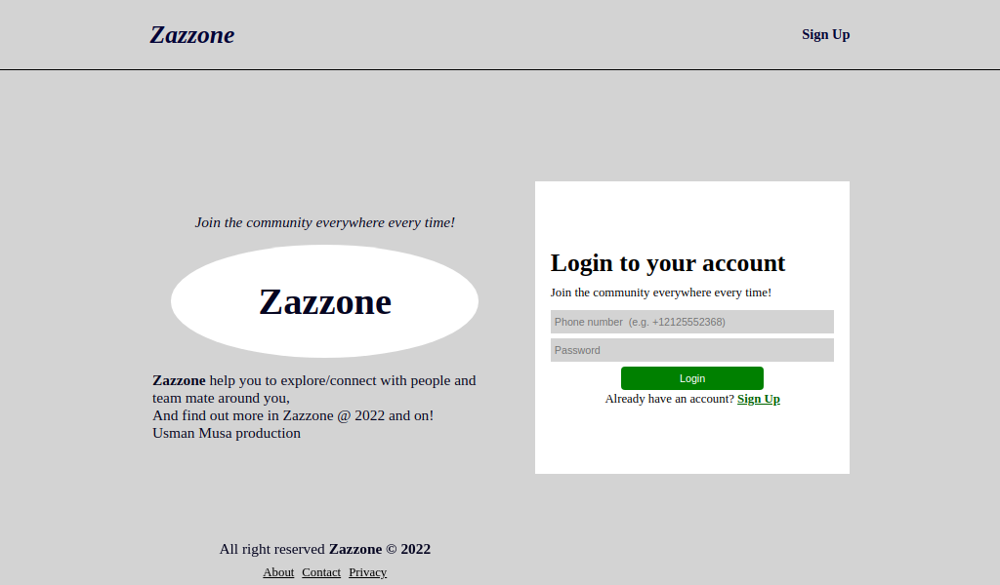
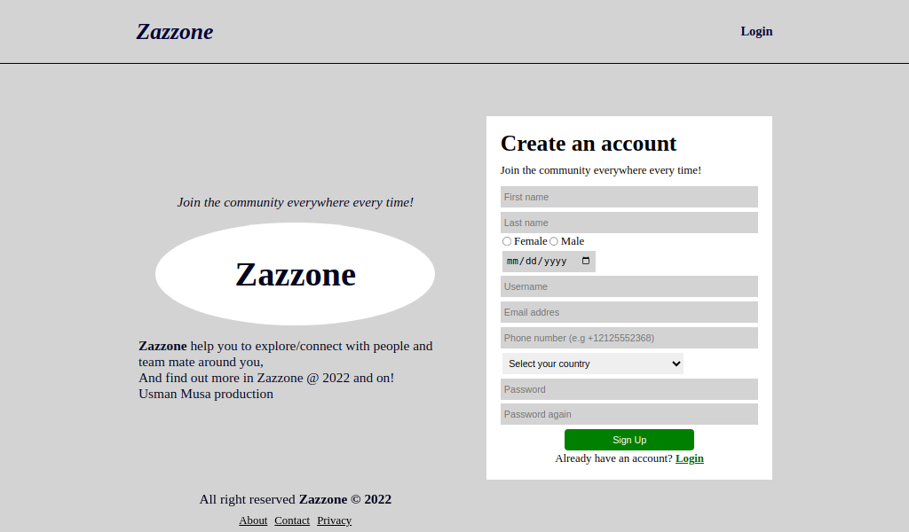

# zazzone

A social media website project developed using django web framework in `2022` and updated in `2023`, these update include:

-   Update requirements.txt file (libraries versions of 2023)
-   Update README file
-   Replace 2 spaces indentation with 4 space indentation (tab)

## Usage

First clone the repository

```sh
git clone https://github.com/usmanmusa1920/zazzone
```

Enter into the directory

```sh
cd zazzone
```

Create virtual environment

```sh
python -m venv zazzone_venv
```

Activate virtual environment

```sh
source zazzone_venv/bin/activate
```

Install requirements

```sh
pip install -r requirements.txt
```

Now run the development server by:

```sh
python manage.py runserver
```

Visit the url address `http://localhost:8000`, use any of the below users credential to login!

**Phone number:** +2348000000001  **Password:** passwd123

**Phone number:** +2348000000002  **Password:** passwd123

**Phone number:** +2348000000003  **Password:** passwd123

**Phone number:** +2348000000004  **Password:** passwd123

## Screen shot






Some libraries used for this application:

**django-countries** it provides a country field for django models. **Note** add `django_countries` in the INSTALLED_APP, install django-countries by `pip install django-countries`

**django-phonenumber-field** it is an international phone number field for django models, a django library which interface with python phonenumber (the below phonenumbers) to validate, pretty print and convert phone numbers. **Note** add `phonenumber_field` in the INSTALLED_APP, install django-phonenumber-field by `pip install django-phonenumber-field`

**phonenumbers** it is a python version of google's common library for parsing, formatting, storing and validating international phone numbers, install phonenumbers by `pip install phonenumbers`

**Geocoder** is a simple Python geocoding library. It makes it very easy to work with geocoding providers such as Google or Bing. It is also very useful to locate an IP address, install geocoder by `pip install geocoder`

Folium is a library that makes it easy to visualize data that has been manipulated in Python on an interactive leaflet map, install folium by `pip install folium`
